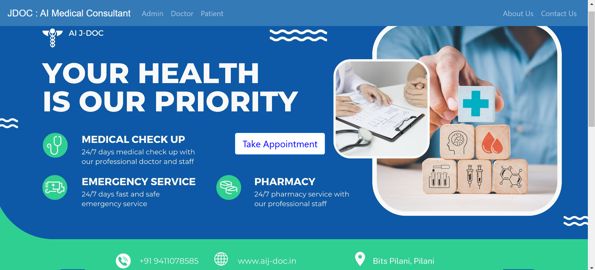
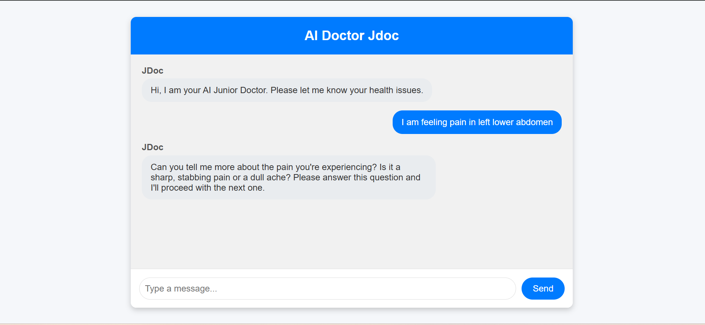
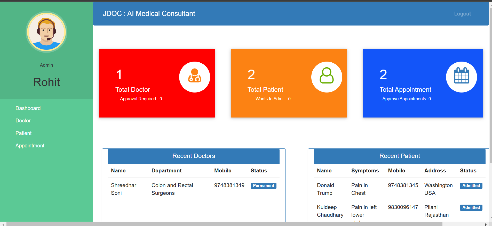
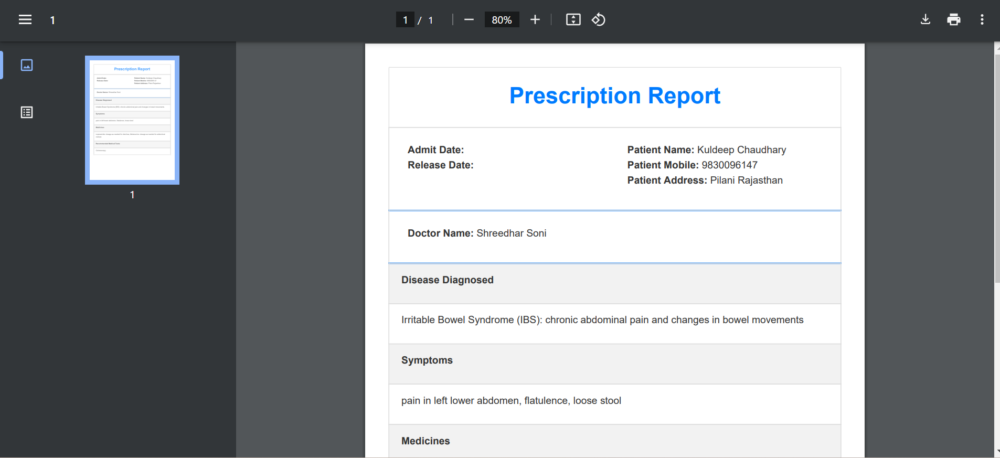
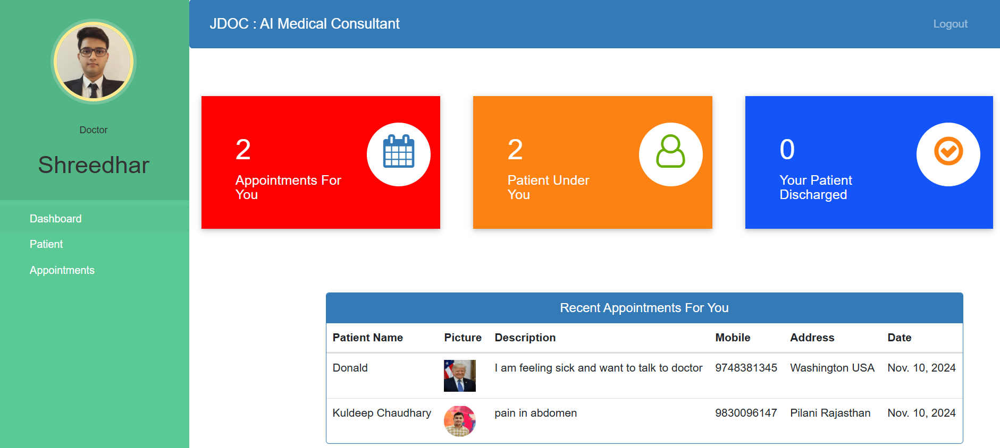

# J-Doc: AI-Enabled Medical Consultant and Management System

Welcome to **J-Doc**, an AI-powered medical consultant platform designed to enhance healthcare efficiency, accessibility, and quality. With J-Doc, patients can access medical consultation anytime, anywhere, through an AI-enabled virtual doctor, and doctors can streamline their workflow, focusing on finalizing diagnoses and treatment plans. Senior doctors verify final prescriptions, adding a layer of reliability to AI recommendations, optimizing their efficiency, and reducing administrative overhead.

---

## Features and Benefits of J-Doc

### **Key Features**
1. **24/7 AI Doctor**: AI-driven consultations available at all times for immediate support, ensuring that patients don't have to wait.
2. **Remote Consultation**: Patients can access expert medical advice from the comfort of their homes, ideal for telehealth services.
3. **Doctor Efficiency**: Automates preliminary consultations, allowing doctors to focus on critical cases, improving healthcare quality and reach.
4. **Admin Controls**: Facilitates management of doctors, patients, appointments, and billing, streamlining administrative functions.
5. **User-Friendly Interfaces**: Distinct, role-based dashboards for admins, doctors, and patients.

### **Unique Selling Proposition (USP)**
With AI-powered tools like the **Junior Doctor Chatbot**, J-Doc revolutionizes healthcare management by integrating Large Language Models (LLMs) for:
- **Symptom Analysis**: Quickly identifies symptoms to provide a list of possible conditions.
- **Disease Diagnosis**: Diagnoses potential diseases based on reported symptoms.
- **Medication & Test Recommendations**: Recommends relevant tests and treatments, verified by senior doctors for accuracy.

By handling initial patient queries and data collection, the LLM reduces time spent on basic diagnostics, allowing healthcare professionals to concentrate on complex cases, ultimately improving patient outcomes and doctor productivity.

---

## Application Screenshots

### Homepage


### AI-Powered J-Doc Chatbot


### Admin Dashboard


### Prescription


### Doctor Dashboard


---

## Application Flow

1. **Patient Interaction**: Patients start by chatting with the AI-powered chatbot, which collects relevant information.
2. **AI Consultation**: The chatbot processes the data and provides preliminary recommendations.
3. **Doctor Review**: Senior doctors review AI recommendations, finalize the diagnosis, and create a treatment plan.
4. **Patient Access**: Patients can view their personalized diagnosis and treatment in the prescription tab.

---

## Key Functionalities

### **AI-Powered Junior Doc Chatbot**
- **Symptom Checker**: Identifies and lists potential conditions based on symptoms.
- **Disease Diagnosis**: Diagnoses conditions, verified by the doctor for accuracy.
- **Medicine Recommendation**: Suggests treatments, verified by senior doctors.
- **Medical Test Recommendations**: Recommends necessary tests for further diagnosis.

### **Admin Dashboard**
- **User Management**: Register, view, approve/reject doctors and patients.
- **Appointment Management**: Approve or reject patient-booked appointments.
- **Billing**: Generate, view, and download invoices based on treatment costs.

### **Doctor Dashboard**
- **Patient Management**: View assigned patients' details, including symptoms and contact info.
- **Appointment Management**: Track and manage appointments booked by admin.
- **Job Application**: Apply for a hospital position with approval required by admin.

### **Patient Dashboard**
- **Doctor Details**: View assigned doctors' profiles, including specialization and contact information.
- **Appointment Scheduling**: Request appointments with approval required by admin.
- **Billing Access**: View and download invoices upon discharge.

---

## How to Run This Project

### **Prerequisites**
- Python 3.9 or Conda environment.
- Docker installed on the system.

### **Setup Instructions**
1. **Clone or Download the Project**:
   - Download and extract the project zip file.

2. **Install Dependencies**:
   ```bash
   pip install -r requirements.txt
   ```

3. **Start Ollama Docker Container**:
   - To deploy the Large Language Model (LLM) using Ollama's dockerized setup, run below commands one by one:
   ```bash
   docker run -d -v ollama:/root/.ollama -p 11434:11434 --name ollama ollama/ollama
   docker cp sem/final_project/Jdoc-AI-Medical-Consultant/llm/jdoc_modelfile ollama:/root/.ollama/
   docker exec -it ollama ollama create mymodel -f /root/.ollama/jdoc_modelfile
   ```

4. **Database Setup**:
   - From the project directory, initialize the database:
   ```bash
   python manage.py makemigrations
   python manage.py migrate
   python manage.py runserver
   ```

5. **Run the Server**:
   ```bash
   python manage.py runserver
   ```

6. **Access the Application**:
   - Open your browser and navigate to [http://127.0.0.1:8000/](http://127.0.0.1:8000/).

---

## Technical Stack

- **Backend**: Django
- **Frontend**: HTML, CSS, JavaScript
- **Database**: SQLite
- **API Architecture**: REST API
- **LLM Deployment**: Ollama Dockerized Service
- **Model Used**: llama3.1 for AI chat functionality

---

## About the Developers

**Group 11 - SEM Project**  
- **Rohit Singhee**
- **Kuldeep Chaudhary**
- **Shreedhar Soni**
- **Anmol Sharma**

J-Doc is the result of collaborative development by passionate individuals aiming to make healthcare accessible, efficient, and innovative.